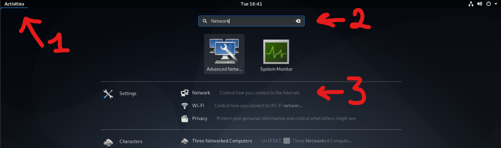
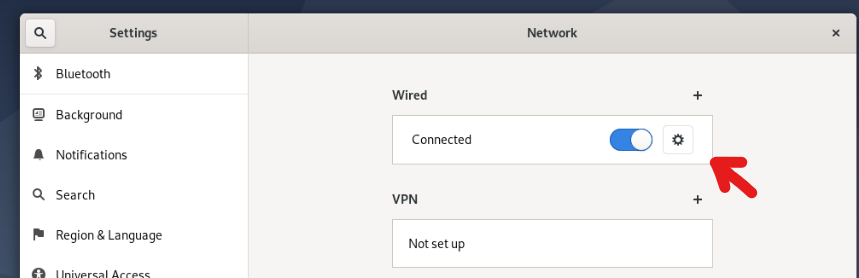
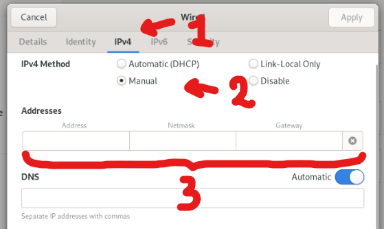
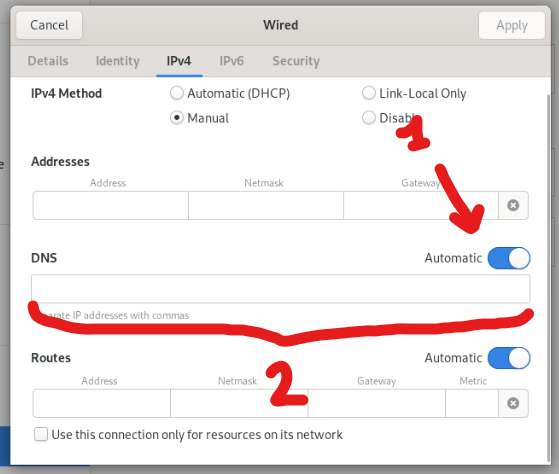

##### IBRAHIM BAHI
# Exercise Réseau

---
Q1: Avec quelle(s) commande(s) pouvez-vous vérifier le nom des interfaces réseau du système et l’adresse ip qui y es associée ?

A: `ip a`. La commande `ip` nous permet d'afficher des informations sur notre configuration réseau, on y rajoutant le parametre `a`, la commande nous affiche les noms des interfaces réseau et de leur addresse IP respective.

---

Q2: Avec quelle(s) commande(s) pouvez-vous vérifier la passerelle (gateway) de votre système ?

A: `ip route`. La commande `ip` nous permet d'afficher des informations sur notre configuration réseau, en y rajoutant le parametre `route`, on peut afficher la default gateway de notre réseau.

---

Q3: Quel fichier devez-vous modifier pour changer la configuration de vos interfaces réseau ? 

A: `/etc/network/interfaces`. le fichier `interfaces` qui se trouve dans `/etc/network`, est le fichier de configuration de nos interfaces réseaux, pour pouvoir modifier ce fichier il faut etre en `root`

---

Q4: Modifiez la configuration de votre interface réseau principale pour utiliser les paramètres fixe suivants :
  1. Adresse IP : l’adresse IP que vous aviez obtenu via DHCP.
  2. Masque de sous-réseau : le masque que vous aviez obtenu via DHCP.
  3. Passerelle par défaut : l’adresse IP que vous aviez obtenu via DHCP.
  4. Serveur de nom : utilisez l’adresse IP « 8.8.8.8 ».

A: Pour modifier la configuration IP et DNS de notre systeme il faudra modifier quelques fichiers, pour cela on utilise le programme `nano`:
    Pour modifier l'adresse IP donné via le DHCP en adresse IP statique nous devons modifier le fichier `/etc/network/interfaces`. 
    Une fois dans le fichier, on peut appercevoir plusieurs lignes, les lignes commençant par un `#` on peut les ignorer car ce ne sont que des commentaires.

```
    # The loopback network interface
    auto lo
    iface lo inet loopback
    
    # The primary network interface
    allow-hotplug enp1s0
    iface enp1s0 inet dhcp   <------
    # This is an autoconfigured IPv6 interface
    iface enp1s0 inet6 auto
```
Mais d'abord nous devons trouver notre configuration réseau donnée via le DHCP, pour cela on utilise la commande `ip a`.
  1. La ligne qui nous importe le plus est `iface enp1s0 inet dhcp`, cette ligne nous dis que l'interface `enp1s0` a son adresse ip donné par le DHCP, nous devons modifier cette ligne pour lui donner une adresse IP statique. On remplace le `dhcp` a la fin de la ligne par static et on rajoute a la ligne avec une tabulation la configuration IP qu'on souhaite:

```
    allow-hotplug enp1s0
    iface enp1s0 inet dhcp
      address 192.168.1.2   <------
```
  2. Pour spécifier le masque de sous-réseau faudra rajouter le mask soit en notation CIDR ou en décimal, dans ce cas on souhaite lui donner le masque `255.255.255.0` (notation décimale) ou `/24` (notation CIDR)

```
    allow-hotplug enp1s0
    iface enp1s0 inet dhcp
      address 192.168.1.2/24   <------
```

  3. Pour spécifier la paserelle par default faudra rajouter une nouvelle ligne avec une tabulation spécifiant son adresse de cette maniere:

```
    allow-hotplug enp1s0
    iface enp1s0 inet dhcp
      address 192.168.1.2/24
      gateway 192.168.1.1   <------
```
  En suite pour modifier l'adresse IP du DNS il faudra modifier le fichier `/etc/resolv.conf`, une fois ouvert le fichier avec le programme `nano` voici ce qu'on aperçoit:

```
    domain home
    search home
    nameserver 10.10.0.1   <------
```

La partie qui nous interesse est la derniere ligne, car elle spécifie l'adresse de notre `nameserver` (notre serveur DNS), pour changer de serveur faut simplement changer l'adresse IP:

```
    domain home
    search home
    nameserver 8.8.8.8   <------
```

---

Q5: Lorsque vous modifiez le fichier de configuration réseau, avec quelle(s) commande(s) pouvez-vous appliquer ce changement ?


A: `systemctl restart networking.services`. `systemctl` permet de gerer les services qu'une machine peut utiliser, dans ce cas on ajoute le parametre `restart` pour relancer le service `nerworking.services` qui est le service qui gere notre réseau.

---

Q6: Modifiez la configuration de votre interface réseau principale pour utiliser les paramètres fixe suivants :
  1. Adresse IP : l’adresse IP que vous aviez obtenu via DHCP.
  2. Masque de sous-réseau : le masque que vous aviez obtenu via DHCP.
  3. Passerelle par défaut : l’adresse IP que vous aviez obtenu via DHCP.
  4. Serveur de nom : utilisez l’adresse IP « 8.8.8.8 »


A: La machine virtuelle utilise comme environement graphique GNOME, des captures d'écran vont illustrer les étapes pour modifier la configuration IP de la machine et l'adresse du serveur DNS:

  1. D'abord, nous devons savoir notre addresse IP trouvé via le DHCP, je n'ai pas trouvé un endroit dans l'interface GNOME, du coup j'utilise le terminal et j'execute la commande `ip a`. Maintenant que j'ai la configuration IP on peut continuer via l'interface graphique.
  Nous devons acceder au options, pour cela on peut acceder a notre barre de recherche en appyant sur le bouton Activities (1) en haut a droite et ensuite taper dans la recherche "Network" (2), pour en suite cliquer sur network (3).

Une fois dans les parametres, on clique sur l'engrenage indiquée sur la fleche.
 
La on peut voir noter configuration réseau (sans le masque de sous-réseau, mais grace a l'invite de commande on sait que c'est 255.255.255.0)
Il faudra en suite cliquer sur IPv4 (1) et cocher "Manual" (2) et remplire les champ "Adresses" (3)


Pour ces champs la on y mettera notre adresse IP "10.10.0.15" notre masque de sous-réseau "255.255.255.0" et en suite notre paserelle par defaut "10.10.0.1"
Pour le faudra le mettre en mode "Manuel" (1) et remplire le champ avec notre nouvelle adresse IP 8.8.8.8 
